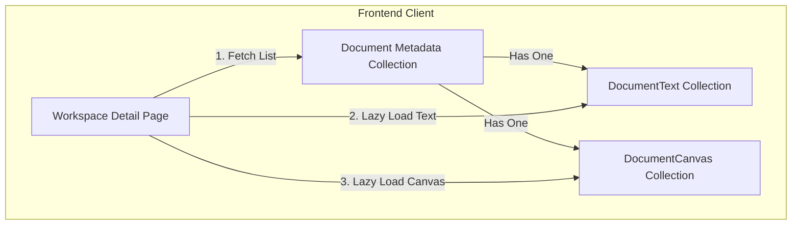

# Document Module Architecture & Database Burden Optimization

This module manages collaborative workspace documents that integrate both rich text editing (Notes) and an infinite diagramming canvas (Tldraw).

## Database Burden Challenge
Collaborative drawing canvases generate large JSON snapshots (nodes, lines, shapes, and history). Rich-text notes, by contrast, are small strings updated frequently (autosaved every 1.5s).
Storing both in a single database document causes the following issues:
1. **Massive Over-fetching**: Listing documents or loading document metadata forces MongoDB to load megabytes of canvas binary/JSON content.
2. **Wasteful Network IO & Disk Write**: If a user types one letter in the notes editor, the entire canvas snapshot must be re-sent and rewritten to database, causing high latency, database CPU usage, and SSD wear.
3. **Index Size Inflation**: Heavy collections increase RAM requirements for keeping indices in-memory.

## Solution: Separated Data Pipeline
We split the data models into three collections, decoupling the document metadata, text notes, and canvas snapshots.

### 1. Database Schemas
* **Document Metadata (`document.model.js`)**: Stores only metadata (title, createdBy, workspaceId, version, timestamps).
* **Document Text (`documentText.model.js`)**: Stores only the text content. Unique index on `documentId`.
* **Document Canvas (`documentCanvas.model.js`)**: Stores the heavy Tldraw snapshot. Unique index on `documentId`.

### 2. Endpoints
* `GET /api/document/:documentId` - Retrieves only metadata.
* `GET /api/document/:documentId/text` - Retrieves notes content.
* `GET /api/document/:documentId/canvas` - Retrieves canvas snapshot.
* `PUT /api/document/:documentId` - Updates document metadata (e.g. title).
* `PUT /api/document/:documentId/text` - Autosaves notes without canvas burden.
* `PUT /api/document/:documentId/canvas` - Autosaves canvas without notes burden.

### 3. Dynamic Lazy Loading
The client dynamically reads the `viewMode` state ("notes", "canvas", "split") and fetches the content on demand:
* When viewing **Notes Only**, it only requests the text record.
* When viewing **Canvas Only**, it only requests the canvas record.
* When viewing **Split View**, it requests both.
* If a view toggles after load, it requests the missing resource dynamically.
